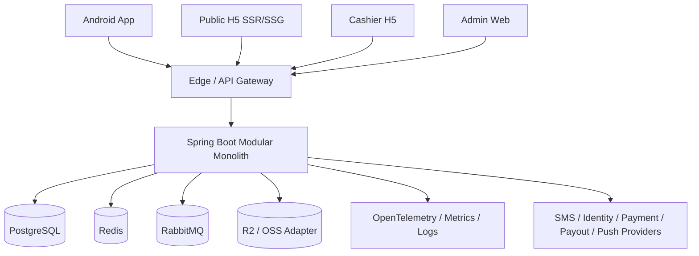

# 系统架构与模块边界 V1.2.2



## 后端领域集群

```text
access      auth · user · identity · admin-rbac · config
content     media · content · search · audit · chat · notification · cms · support
commerce    catalog · order · payment · membership · prop
incentive   redpacket · reward · withdrawal · referral · referral-activity · task
platform    risk · analytics · scheduler · app-release · provider-adapters · accounting · eventing
```

### 强边界规则

- 每个模块拥有自己的表、Repository 和状态机；其他模块不得直接引用其 Repository。
- 同步协作通过公开应用端口或只读查询端口；异步协作通过领域事件。
- 跨模块事件与业务写入使用同一 PostgreSQL 事务写入 `outbox_events`。
- 消费者先写 `inbox_messages` 去重，再执行幂等业务逻辑。
- Redis、消息队列和搜索索引均非资金与状态最终事实源。
- 资金事实只允许通过 `accounting_transactions` + `accounting_entries` 过账。

## 前端边界

- Android：`core-*` 与 `feature-*` 分层，feature 不得绕过生成 API Client。
- Admin/H5：pnpm workspace，共享类型、API Client、校验和 Token；公开 H5、收银台和后台分别部署，CSP/Cookie/域名隔离。
- 公开品牌/分享页优先 SSR/SSG；收银台使用一次性令牌和严格回跳白名单；实名回跳使用一次性 state。
